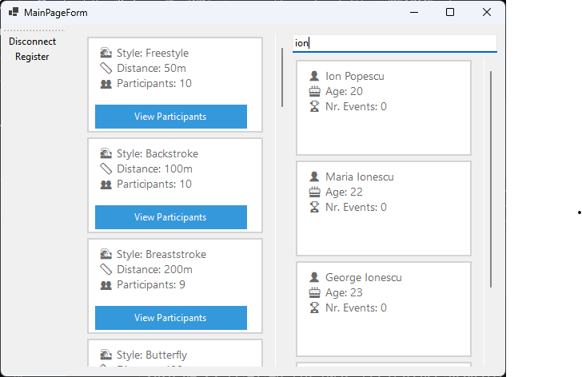
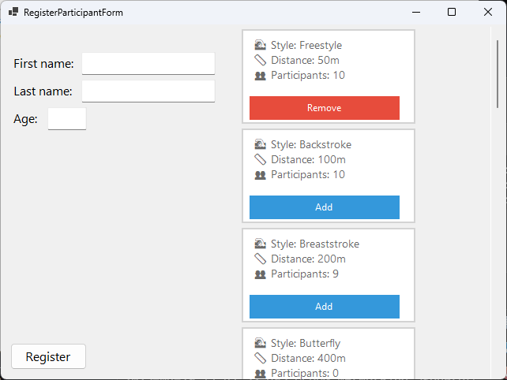

🏊 Swimming Competition Manager

A desktop application for managing participants across multiple swimming competitions.

🛠️ Technologies

C#, WinForms, Log4net, SQLite, Visual Studio 2022, TCP Sockets, JSON

🚀 Features

  -User authentication (login/logout)
  
  -View list of swimming events

  -Add new participants to selected events

  -Filter participants by event and name

  -Real-time updates (for connected clients)

🖥️ Screenshots

🔐 Login Screen

📋 Main Menu

🧍 Register New Participant

